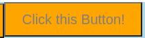

# Styled-components

[Styled Components Full Tutorial](https://www.youtube.com/watch?v=-FZzPHSLauc)

```shell
$ npm ls
├── @testing-library/jest-dom@5.12.0
├── @testing-library/react@11.2.7
├── @testing-library/user-event@12.8.3
├── react-dom@17.0.2
├── react-scripts@4.0.3
├── react@17.0.2
├── styled-components@5.3.0
└── web-vitals@1.1.2
```

## 3つ3色のボタンを表示

```js
//Button.style.jsx
import styled from 'styled-components';

export const BlueButton = styled.button`
  width: 200px;
  height: 50px;
  background-color: blue;
`;

export const GreenButton = styled.button`
  ...
`;

export const RedButton = styled.button`
  ...
`;
```

```js
// App.js
import { RedButton, GreenButton, BlueButton } from './Components/Button.style';

function App() {
  return (
    <div className="App">
      <RedButton>Click this Button!</RedButton>
      <BlueButton>Click this Button!</BlueButton>
      <GreenButton>Click this Button!</GreenButton>
    </div>
  );
}

export default App;
```


## ボタン色をpropsで渡す

```js
// Button.style.jsx
import styled from 'styled-components';

export const Button = styled.button`
  width: 200px;
  height: 50px;
  background-color: ${(props) => props.backgroundColor};
`;
```

```js
// App.js
      <Button backgroundColor="red">Click this Button!</Button>
      <Button backgroundColor="orange">Click this Button!</Button>
```

## コンポーネントにスタイル適用

これまではコンポーネントの内部のエレメントにスタイルを適用していた。コンポーネント自体にスタイルを適用することもできる。

```js
// Container.style.jsx
import styled from 'styled-components';

export const AppContainer = styled.div`
  width: 100vw;
  height: 100vh;
  background-color: lightblue;
`;
```

```js
// App.js
import { Button } from './Components/Button.style';
import { AppContainer } from './Components/Container.style';

function App() {
  return (
    <AppContainer>
      <Button backgroundColor="red">Click this Button!</Button>
      <Button backgroundColor="orange">Click this Button!</Button>
    </AppContainer>
  );
}

export default App;
```


## 疑似要素にスタイル適用

```js
// Button.style.jsx
  &:hover {
    background-color: coral;
  }
  &:active {
    background-color: wheat;
  }
```

## innerTextにスタイル適用

```js
// Button.style.jsx
export const ButtonLabel = styled.label`
  font-size: 20px;
  color: gray;
```

```js
// App.js
import { AppContainer } from './Components/Container.style';
...
<ButtonLabel>Click this Button!</ButtonLabel>
```



## 疑似要素

```js
// Button.style.js
  &:hover {
    & label {
      color: tomato;
    }
```

```js
// App.js
      <Button backgroundColor="orange">Click this Button!</Button>
      <Button backgroundColor="orange">
        <ButtonLabel>Click this Button!</ButtonLabel>
      </Button>
```

`<ButtonLabel>`コンポーネントのボタンラベルにスタイルが適用される。

`<Button>`コンポーネントのボタンラベルはスタイル変化なし

